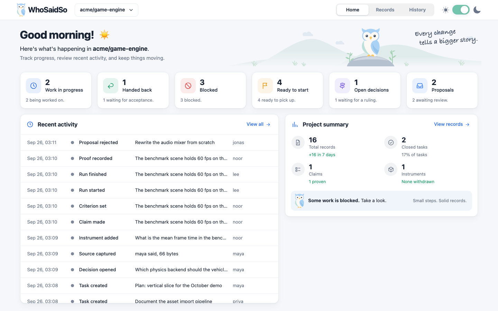

<p align="center">
  
</p>

<h1 align="center">WhoSaidSo</h1>

<p align="center">
  <strong>Keep your agents accountable and your claims proven.</strong><br />
  Every task, idea and decision is written down as it happens, and every answer points back to who said so.
</p>

<p align="center">
  <a href="#get-started">Get started</a> ·
  <a href="#what-it-is-built-on">What it is built on</a> ·
  <a href="USAGE.md">Usage and setup</a>
</p>



WhoSaidSo is one small program: a single Go binary with no dependencies. A project's record is plain JSON files in
an append-only ledger inside the repository, committed with your code. It is bare-bones on purpose, just what one
project needs. It doesn't need a database; if a project ever outgrows plain files, SQLite could sit behind the same
commands. Run `whosaidso ui` to browse the record in your browser.

## What it is built on

**Testing and proving.** Nothing is done because someone says it is. A claim is proven against a criterion fixed
before the run, with every result counted, failures included.

**Accountable agents.** Tasks, ideas and decisions are written down as they happen, so nothing is forgotten between
sessions, and every claim points back to who made it and what proved it.

**Accountable tools.** Instruments and measurements are held to the same standard: each one declares what it cannot
see, so a correct number can't quietly answer the wrong question. When something can't be checked, the answer is
UNKNOWN, never a guess.

**Knowing where you are.** One command shows what is done, what is owed, what is blocked, and why.

**Agent first.** Built for AI agents doing the work every day. People read the same record, in the terminal or the
viewer.

## Get started

Tell your coding agent:

```text
Install WhoSaidSo from https://github.com/alex2481kobe/whosaidso and set it up in this project.
```

Or do it yourself: `go install github.com/alex2481kobe/whosaidso/cmd/whosaidso@latest`, then run `whosaidso help`.
Full steps and the first loop are in [Usage and setup](USAGE.md).

## Works with

Any project and any agent that can run a command. Tested on macOS and, in CI, on Linux; Windows is untested. Early:
the design is still settling. Until 1.0 the ledger format may change; when it does, the release includes a one-time
converter.

## What could come next

- **SQLite for large ledgers**, behind the same commands, if a project outgrows plain files.
- **Sub-projects**: tag records by sub-project in one ledger, so folders can move without losing their records.
- **Moving records between ledgers**, when a sub-project leaves for its own repo.
- **Adding records from the viewer**, through the same capture and admit.

Apache-2.0.
